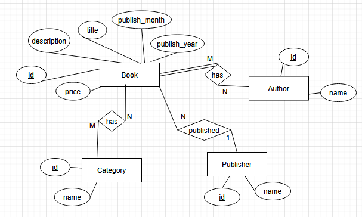
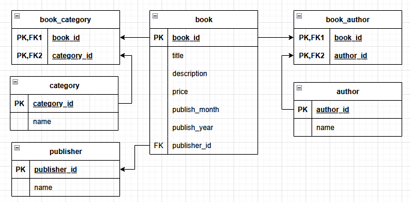

# Overview

## ER-diagram

## ER-schema

## Database table description

### book

| Column Name | Data Type | Description |
|---|---|---|
| book_id | INTEGER | Unique identifier for each book (Primary Key) |
| title | VARCHAR(255) | Title of the book |
| description | TEXT | Description of the book |
| price | NUMERIC(10,2) | Starting price of the book |
| publish_month | INTEGER | Month the book was published |
| publish_year | INTEGER | Year the book was published |
| publisher_id | INTEGER | Foreign key referencing publisher(publisher_id) |

---

### publisher

| Column Name | Data Type | Description |
|---|---|---|
| publisher_id | INTEGER | Unique identifier for each publisher (Primary Key) |
| name | VARCHAR(255) | Name of the publisher |

---

### author

| Column Name | Data Type | Description |
|---|---|---|
| author_id | INTEGER | Unique identifier for each author (Primary Key) |
| name | VARCHAR(255) | Name of the author |

---

### category

| Column Name | Data Type | Description |
|---|---|---|
| category_id | INTEGER | Unique identifier for each category (Primary Key) |
| name | VARCHAR(255) | Name of the category |

---

### book_author

| Column Name | Data Type | Description |
|---|---|---|
| book_id | INTEGER | Foreign key referencing book(book_id) |
| author_id | INTEGER | Foreign key referencing author(author_id) |

Primary Key: (book_id, author_id)

---

### book_category

| Column Name | Data Type | Description |
|---|---|---|
| book_id | INTEGER | Foreign key referencing book(book_id) |
| category_id | INTEGER | Foreign key referencing category(category_id) |

Primary Key: (book_id, category_id)
